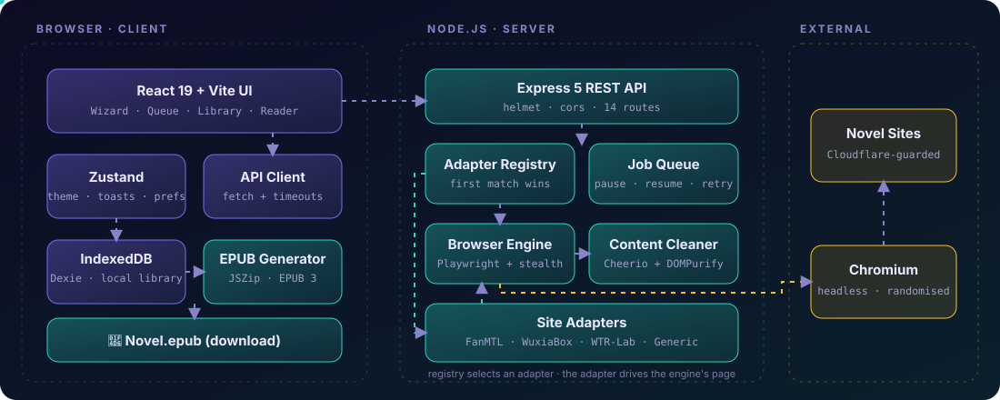
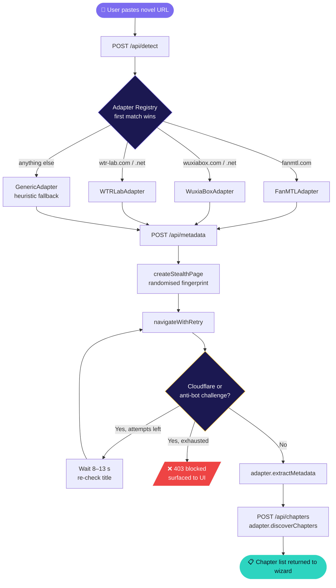
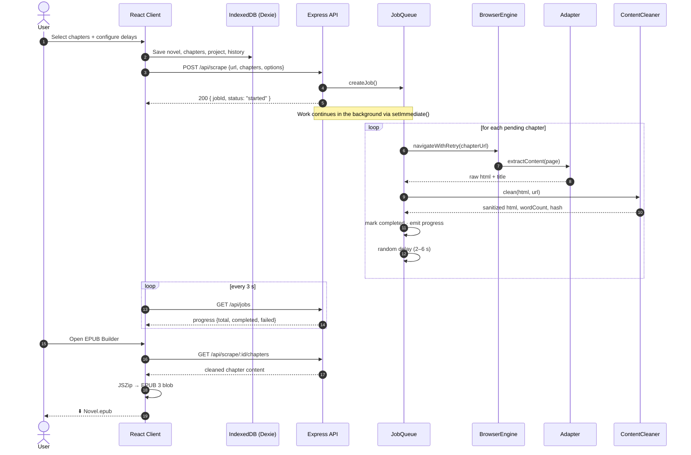
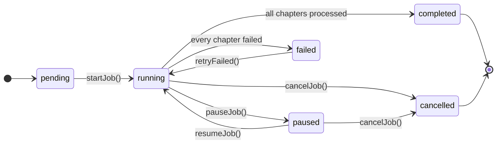
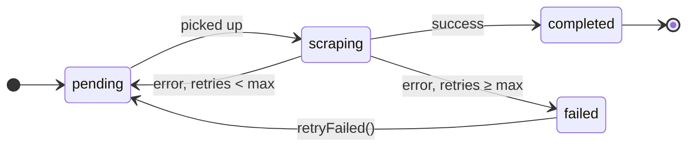
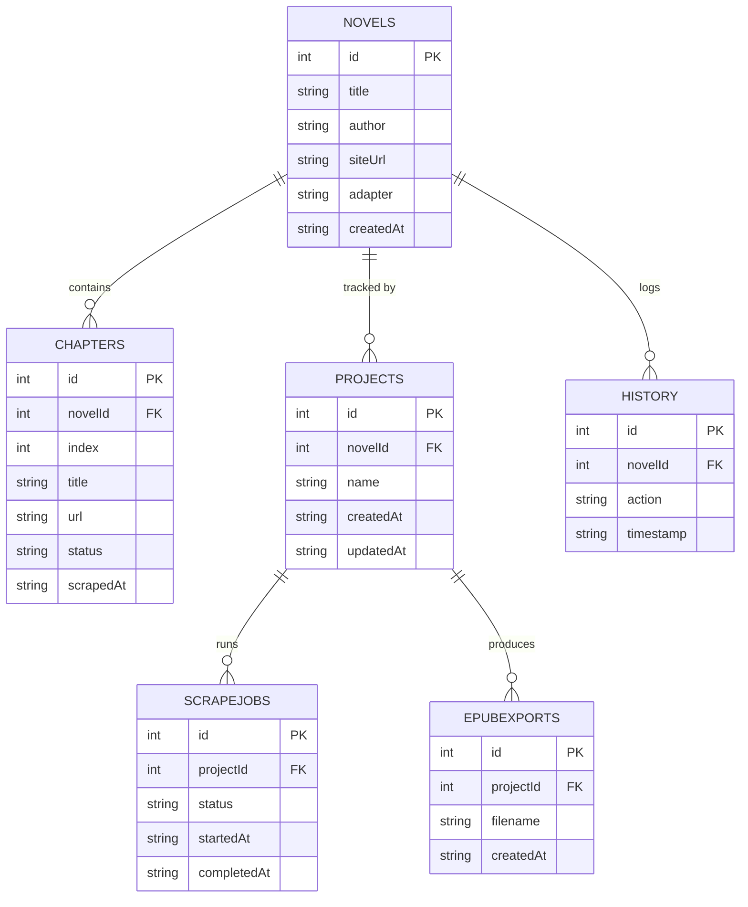

<div align="center">



<br/>

**A full-stack, adapter-driven web-novel scraper with a stealth browser engine,<br/>a resumable job queue, and an offline EPUB 3 builder.**

<br/>

[](https://nodejs.org)
[](https://expressjs.com)
[](https://playwright.dev)
[](https://react.dev)
[](https://vitejs.dev)
[](https://www.w3.org/TR/epub-33/)
[](./server/Dockerfile)
[](#-license)

<br/>

[**Overview**](#-overview) ·
[**Features**](#-features) ·
[**Architecture**](#-architecture) ·
[**Quick Start**](#-quick-start) ·
[**API**](#-api-reference) ·
[**Adapters**](#-writing-a-new-adapter) ·
[**Roadmap**](#-roadmap)

</div>

<br/>

---

## 📖 Overview

**WebNovel Scraper** turns a novel's table-of-contents URL into a clean, standards-compliant **EPUB 3** file you can read on any e-reader.

You paste a URL. The app detects which site it is, pulls the metadata and chapter list, lets you choose exactly which chapters you want, then scrapes them in the background using a stealth Playwright browser. Each chapter is cleaned of ads and junk, stored locally in your browser, and finally packaged into an EPUB, all without your content ever touching a third-party service.

<div align="center">



<sub>▲ The full pipeline, from detection to a downloaded <code>.epub</code>.</sub>

</div>

### Why it's built this way

| Design decision | What it gives you |
|---|---|
| **Adapter pattern** for each site | Add a new source by writing one class, with no changes to the core engine |
| **Generic heuristic fallback** | Unknown sites still work, using content-block detection |
| **Server scrapes, browser stores** | The heavy lifting (Playwright) is server-side; your library lives in **IndexedDB** on your device |
| **In-memory job queue** with control endpoints | Pause, resume, cancel, and retry individual failed chapters mid-run |
| **EPUB built client-side** with JSZip | No upload of your library anywhere to generate the book |

---

## ✨ Features

<table>
<tr>
<td width="50%" valign="top">

### 🕷️ Scraping Engine
- **Stealth Playwright**: randomised user-agent, viewport, locale and timezone per session
- **Anti-detection patches**: `navigator.webdriver`, plugins, languages and `window.chrome` overrides
- **Cloudflare-aware navigation**: detects challenge pages ("Just a moment…", 403/503) and waits/retries
- **Ad & tracker blocking** at the network layer
- **Human-like pacing**: randomised 2–6 s delay between chapters
- **Optional proxy** support (HTTP/SOCKS)

</td>
<td width="50%" valign="top">

### 🧩 Adapter System
- **3 dedicated adapters**: FanMTL, WuxiaBox, WTR-Lab
- **Generic fallback** using content heuristics for any other site
- **First-match-wins registry**, with the generic adapter always last
- Uniform interface: `extractMetadata` → `discoverChapters` → `extractContent`
- Hybrid strategies: WuxiaBox uses **HTTP + Cheerio** for metadata and **Playwright** for content

</td>
</tr>
<tr>
<td width="50%" valign="top">

### 🧹 Content Cleaning
- Strips scripts, ads, nav, comments, social widgets, popups and footers
- Removes inline styles, event handlers and `data-*` attributes
- Resolves relative links/images to absolute URLs
- Converts `<br><br>` runs into real paragraphs
- Final **DOMPurify** allow-list pass
- Returns **word count** and an **MD5 content hash** per chapter (an `isDuplicate()` helper exists, ready to be wired in)

</td>
<td width="50%" valign="top">

### ⏯️ Job Control
- Pause / resume / cancel any running job
- **Per-chapter retry** with a configurable ceiling (default 3)
- Retry only the failed chapters, without restarting the whole novel
- Live progress: total / completed / failed / current
- UI polls the queue every **3 s**

</td>
</tr>
<tr>
<td width="50%" valign="top">

### 📚 EPUB 3 Builder
- Valid OCF package: `mimetype` (stored, first), `container.xml`, OPF, `nav.xhtml`, plus a legacy **NCX** for older readers
- **Title page** included; the generator also supports a **cover image** (`coverBlob`), though the Builder UI doesn't wire it up yet (see [Roadmap](#-roadmap))
- **Reorder** and **remove** chapters before export
- **Find & replace** inside a chapter
- Editable metadata (title, author, description, language, publisher)
- Import from a live server job *or* from your local library

</td>
<td width="50%" valign="top">

### 🖥️ Client Experience
- **5-step wizard**: URL → Metadata → Chapters → Configure → Start
- Chapter **search**, select-all, deselect-all and range selection
- Built-in **reader** with Light / Dark / Sepia themes
- Font-size and line-height controls, keyboard nav (← →), reading-progress bar
- **Offline-first** persistence via Dexie (IndexedDB)
- Lazy-loaded routes, skeleton loaders, toasts, collapsible sidebar

</td>
</tr>
</table>

---

## 🛠️ Tech Stack

<div align="center">

| Layer | Technologies |
|:---:|:---|
| **Frontend** |       |
| **Backend** |       |
| **Storage** |   |
| **DevOps** |   |

</div>

---

## 🏗️ Architecture

### System at a glance

<div align="center">

</div>

### Request flow: from URL to chapters



### Scrape job lifecycle



### Job state machine

Every job and every chapter moves through a small, explicit state machine, which is what makes pause, resume and selective retry reliable.





### Client data model (IndexedDB)



### Content-cleaning pipeline


---

## 🚀 Quick Start

### Prerequisites

| Requirement | Version | Notes |
|---|---|---|
| **Node.js** | 18 or newer | Both client and server |
| **Playwright browsers** | Chromium | Installed via `npx playwright install chromium` |

### 1 · Clone

```bash
git clone https://github.com/darshil158/WebScrapper.git
cd WebScrapper
```

### 2 · Start the backend

```bash
cd server
npm install
npx playwright install chromium
npm run dev          # → http://localhost:3001
```

You should see:

```text
🚀 WebNovel Scraper API running at http://localhost:3001
📚 Adapters: FanMTL, WuxiaBox, WTR-Lab, Generic
```

### 3 · Start the frontend

```bash
cd client
npm install
npm run dev          # → http://localhost:5173
```

### 4 · Scrape your first novel

1. Open **http://localhost:5173** and go to **New Scrape**.
2. Paste the novel's **main/table-of-contents page** URL, not a single chapter.
3. Review the detected metadata, choose your chapters, tune the delays, and hit **Start**.
4. Watch progress in **Queue**, then open **EPUB Builder** → **Generate EPUB**.

### 🐳 Run the backend with Docker

The included `Dockerfile` is based on the official Playwright image, so browsers come pre-installed.

```bash
cd server
docker build -t webnovel-scraper-api .
docker run -p 3001:3001 webnovel-scraper-api
```

### ⚙️ Configuration

| Variable | Where | Default | Purpose |
|---|---|---|---|
| `PORT` | server | `3001` | API listen port |
| `NODE_ENV` | server | `development` | Set to `development` to expose error messages in 500 responses |
| `VITE_API_URL` | client | `http://localhost:3001/api` | Point the UI at a remote backend |

**Runtime settings** (Settings page, saved to `localStorage`):

| Setting | Default | Description |
|---|---|---|
| Delay | `3000 ms` | Base pause between requests |
| Concurrency | `2` | Stored with the job; chapters are currently processed one at a time |
| Max retries | `3` | Attempts per chapter before it is marked failed |
| Block images | `false` | Skip image downloads for faster scraping |
| Proxy | off | `http://host:port` or `socks5://host:port` |
| EPUB font / size / line-height | Georgia / 16 / 1.8 | Default reading typography |

**Per-job options** (wizard "Configure" step): `delayMin` (2000 ms), `delayMax` (6000 ms), `concurrency` (2), `maxRetries` (3).

---

## 📡 API Reference

Base URL: `http://localhost:3001/api`

| Method | Endpoint | Description |
|:---:|---|---|
| `GET` | `/health` | Liveness check |
| `GET` | `/adapters` | List registered adapters and their domains |
| `POST` | `/detect` | Detect which adapter matches a URL |
| `POST` | `/metadata` | Extract title, author, cover, description, genres, status |
| `POST` | `/chapters` | Discover the full chapter list |
| `POST` | `/scrape` | Start a background scraping job → `{ jobId }` |
| `GET` | `/scrape/:jobId/status` | Job status and per-chapter progress |
| `POST` | `/scrape/:jobId/pause` | Pause a running job |
| `POST` | `/scrape/:jobId/resume` | Resume a paused job |
| `POST` | `/scrape/:jobId/cancel` | Cancel a job |
| `POST` | `/scrape/:jobId/retry` | Re-queue only the failed chapters |
| `GET` | `/scrape/:jobId/chapters` | Fetch cleaned content of completed chapters |
| `GET` | `/jobs` | List all jobs |
| `DELETE` | `/jobs/:jobId` | Delete a job |

<details>
<summary><b>📥 Example: start a scrape job</b></summary>

```bash
curl -X POST http://localhost:3001/api/scrape \
  -H "Content-Type: application/json" \
  -d '{
    "url": "https://example.com/novel/my-novel",
    "novelInfo": { "title": "My Novel", "author": "Someone" },
    "chapters": [
      { "index": 1, "title": "Chapter 1", "url": "https://example.com/novel/my-novel/chapter-1" },
      { "index": 2, "title": "Chapter 2", "url": "https://example.com/novel/my-novel/chapter-2" }
    ],
    "options": { "delayMin": 2000, "delayMax": 6000, "maxRetries": 3 }
  }'
```

```json
{ "jobId": "7f3a9c12-…", "status": "started" }
```

</details>

<details>
<summary><b>📤 Example: job status response</b></summary>

```json
{
  "id": "7f3a9c12-…",
  "status": "running",
  "progress": { "total": 120, "completed": 37, "failed": 1, "current": 39 },
  "chapters": [
    { "index": 1, "title": "Chapter 1", "status": "completed", "wordCount": 1842 }
  ]
}
```

</details>

**Error semantics:** navigation blocked by anti-bot protection returns **`403`** with `"blocked": true`; other upstream failures return **`502`**; missing input returns **`400`**.

---

## 🧩 Writing a New Adapter

Every site lives in its own class under `server/adapters/`. To add one:

**1. Create the class**

```js
// server/adapters/MySiteAdapter.js
const BaseAdapter = require('./BaseAdapter');

class MySiteAdapter extends BaseAdapter {
  static siteMatch(url)        { return /mysite\.com/i.test(url); }
  static get siteName()        { return 'MySite'; }
  static get siteId()          { return 'mysite'; }
  static get siteDescription() { return 'My favourite novel site'; }
  static get domains()         { return ['mysite.com']; }

  async extractMetadata(page, url) {
    await page.goto(url, { waitUntil: 'domcontentloaded' });
    return await page.evaluate(() => ({
      title:       document.querySelector('h1')?.textContent.trim() ?? '',
      author:      document.querySelector('.author')?.textContent.trim() ?? '',
      coverUrl:    document.querySelector('.cover img')?.src ?? '',
      description: document.querySelector('.summary')?.textContent.trim() ?? '',
      genres:      [...document.querySelectorAll('.genre a')].map(a => a.textContent.trim()),
      status:      document.querySelector('.status')?.textContent.trim() ?? '',
    }));
  }

  async discoverChapters(page, url) {
    // return [{ index: 1, title: 'Chapter 1', url: 'https://…' }, …]
  }

  async extractContent(page, url) {
    // return { title, html, wordCount, images: [] }
  }
}

module.exports = MySiteAdapter;
```

**2. Register it** in `server/adapters/registry.js`, **before** `GenericAdapter`:

```js
const adapters = [
  FanMTLAdapter,
  WuxiaBoxAdapter,
  WTRLabAdapter,
  MySiteAdapter,      // ← add here
  GenericAdapter,     // always last
];
```

> 💡 `BaseAdapter` ships helpers you can reuse: `waitForContent()`, `safeText()`, `safeAttr()` and `generateId()`.

### Supported sites

| Adapter | Domains | Strategy |
|---|---|---|
| **FanMTL** | `fanmtl.com` | Playwright, with auto-scroll to load lazy chapter lists |
| **WuxiaBox** | `wuxiabox.com` / `.net` | HTTP + Cheerio for metadata and chapters, Playwright for content |
| **WTR-Lab** | `wtr-lab.com` / `.net` | Playwright, multi-selector fallbacks |
| **Generic** | any | Readability-style heuristics (`article`, `main`, `.content`, `.post-content`, …) |

---

## 📂 Project Structure

```text
WebScrapper/
├── server/                          # Node.js + Express API
│   ├── index.js                     # Routes, middleware, graceful shutdown
│   ├── Dockerfile                   # Playwright-based image
│   ├── adapters/
│   │   ├── BaseAdapter.js           # Abstract interface + helpers
│   │   ├── registry.js              # Adapter discovery (first match wins)
│   │   ├── FanMTLAdapter.js
│   │   ├── WuxiaBoxAdapter.js
│   │   ├── WTRLabAdapter.js
│   │   └── GenericAdapter.js        # Heuristic fallback
│   └── services/
│       ├── browserEngine.js         # Stealth Playwright + Cloudflare handling
│       ├── contentCleaner.js        # Cheerio + DOMPurify pipeline
│       └── jobQueue.js              # In-memory queue, pause/resume/retry
│
└── client/                          # React 19 + Vite SPA
    ├── vercel.json                  # SPA rewrite rules
    └── src/
        ├── App.jsx                  # Router + lazy-loaded pages
        ├── stores/appStore.js       # Zustand: theme, sidebar, toasts, settings
        ├── services/
        │   ├── apiClient.js         # Typed fetch wrapper with timeouts
        │   ├── database.js          # Dexie schema + CRUD
        │   └── epubGenerator.js     # EPUB 3 packaging (JSZip)
        ├── components/              # Sidebar · Navbar · Toast
        └── pages/
            ├── Dashboard.jsx        ├── NewScrape.jsx   (5-step wizard)
            ├── Queue.jsx            ├── Projects.jsx
            ├── Library.jsx          ├── EPUBBuilder.jsx
            ├── EPUBReader.jsx       ├── History.jsx
            └── Settings.jsx
```

---

## 🔐 Security & Responsible Use

- **Sanitised output**: all scraped HTML passes through a strict **DOMPurify** allow-list (tags *and* attributes), and inline event handlers are stripped.
- **`helmet`** is enabled on the API. `cors` is currently open (`origin: true`), which suits local development. **Restrict it before exposing the server publicly.**
- **Local-first data**: your library is stored in your browser's IndexedDB, not on the server. The server keeps job state **in memory only**, so it is cleared on restart.

> [!IMPORTANT]
> This tool is intended for **personal use, archiving, and offline reading**. Always respect each site's **Terms of Service** and `robots.txt`, and support authors and translators where you can. The built-in delays and stealth features exist to avoid overloading servers, not to bypass paywalls or redistribute content.

---

## 🗺️ Roadmap

Ideas that fit naturally with the current architecture:

- [ ] **Persistent job storage** (SQLite/Redis), so jobs survive a server restart
- [ ] **True parallel scraping**: the `concurrency` option is accepted today, but chapters are processed sequentially
- [ ] **Wire up cover embedding**: fetch `coverUrl` into a Blob and pass it as `coverBlob` (the generator already supports it)
- [ ] **Duplicate-chapter detection**: connect the existing MD5 hash and `isDuplicate()` helper
- [ ] **Image embedding** into EPUB packages (currently stored as references)
- [ ] **Test suite** (adapter contract tests against saved HTML fixtures)
- [ ] **Locked-down CORS + optional API key** for public deployments
- [ ] **More adapters**: contributions welcome!

---

## 🤝 Contributing

1. **Fork** the repository and create a branch: `git checkout -b feat/my-adapter`
2. Make your change. For new sites, follow the [adapter guide](#-writing-a-new-adapter).
3. Test manually against a real novel page (metadata → chapters → 2–3 chapter scrape → EPUB).
4. Open a **Pull Request** describing the site and any selector quirks.

---

## 📄 License

The server declares the **ISC** license in `server/package.json`. A top-level `LICENSE` file has not been added yet; add one before publishing to make the terms explicit.

---

<div align="center">

**Built with ☕ by [Darshil](https://github.com/darshil158)**

*If this project saved you some time, consider giving it a ⭐*

</div>
